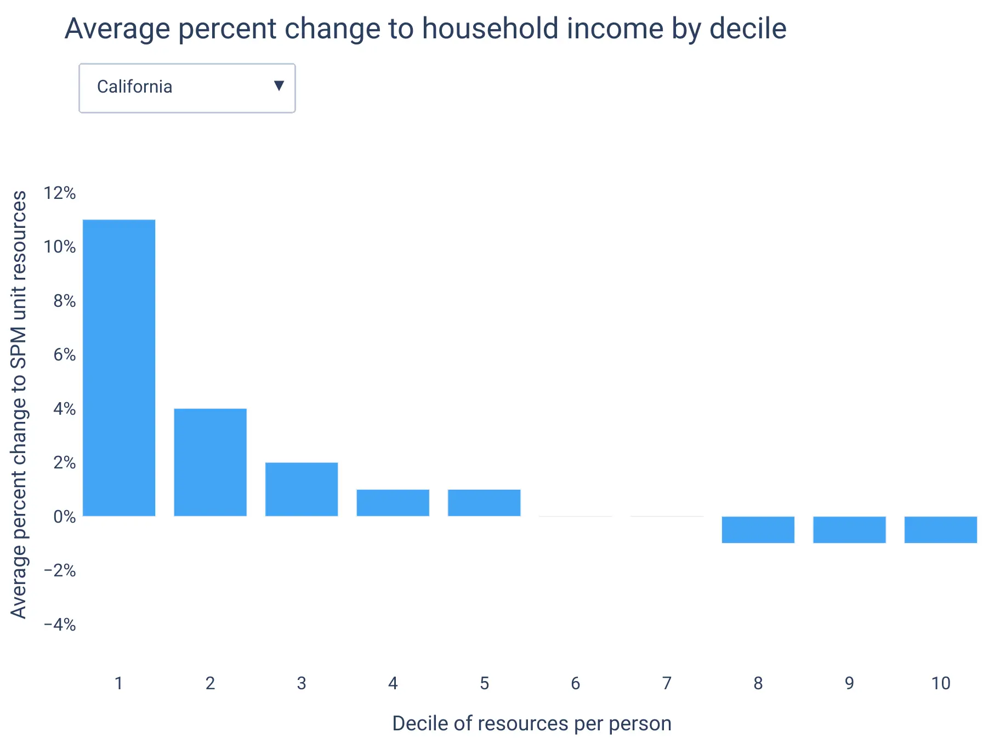

In 2018, the California Democratic Party [added](https://www.cnbc.com/2018/03/12/california-democratic-party-platform-supports-universal-basic-income.html) Universal Basic Income (UBI) to their party platform. Two years later, Assemblymember Evan Low (D-Campbell), who served as a [national co-chair](https://www.ebar.com/news/latest_news//286838) for Andrew Yang's presidential campaign, introduced a [UBI bill](https://leginfo.legislature.ca.gov/faces/billTextClient.xhtml?bill_id=201920200AB2712) for California. In December 2020, Low reintroduced the bill for the 2020-21 legislative session, this time with Senator Scott Wiener (D-San Francisco) as a coauthor and adding some minor revisions.

That bill, [AB65](https://leginfo.legislature.ca.gov/faces/billNavClient.xhtml?bill_id=202120220AB65), establishes the CalUBI program to provide \$1,000 per month to most California adults. We estimate that CalUBI would cut poverty by 83% while adding \$282 billion to the annual state deficit. In this article, we provide more detail into these estimates and suggest paths toward feasible legislation.

## California's extreme economy

California is both rich and poor. It ranks #8 among US states on [GDP per capita](https://en.wikipedia.org/wiki/List_of_U.S._states_and_territories_by_GDP_per_capita), and #7 on [median household income](https://en.wikipedia.org/wiki/List_of_U.S._states_and_territories_by_income). It also ranks [#7 on income inequality](https://www.epi.org/multimedia/unequal-states-of-america/#/California),[^1] and accordingly, its poverty rate is higher than its GDP would predict, [ranking #25](https://en.wikipedia.org/wiki/List_of_U.S._states_and_territories_by_poverty_rate#cite_note-9) based on the Official Poverty Measure (OPM).

When using the Supplemental Poverty Measure[^2] (SPM), however, California ranks [#1 on both overall poverty and child poverty](https://www.census.gov/content/dam/Census/library/publications/2020/demo/p60-272.pdf): 17.2% of Californians are in poverty, compared to 12.5% of Americans. In fact, California has ranked #1 on SPM poverty every year since the Census Bureau first reported it by state in [2011](https://www2.census.gov/library/publications/2012/demo/p60-244.pdf). That's because the SPM, unlike the OPM, adjusts for taxes, in-kind benefits (like the Supplemental Nutrition Assistance Program), and, most importantly for California, local housing costs. As a result of its housing shortage (California has the [fewest housing units per adult](https://twitter.com/MaxGhenis/status/1187898060409466882) of any state), housing in California is notoriously expensive---[second only to Hawaii](https://worldpopulationreview.com/state-rankings/cost-of-living-index-by-state).

California also stands out in terms of taxation.
Due to Prop 13 (1978), a ballot measure that limits property taxes, it ranks [#35 on local property taxes](https://wallethub.com/edu/states-with-the-highest-and-lowest-property-taxes/11585).
The state offsets that revenue loss with high income taxes---its [top marginal rate is 13.3%](https://taxfoundation.org/publications/state-individual-income-tax-rates-and-brackets/), the highest of any state---and high sales taxes---its [state rate is 7.25%](https://taxfoundation.org/2020-sales-taxes/), the highest of any state, and its state and local combined rate ranks #9. It is among the 41 states that [tax capital gains as ordinary income](https://www.cbpp.org/research/state-budget-and-tax/state-taxes-on-capital-gains), which raises significant revenue given its residents claim 8.1% of their income in capital gains, a higher share than all but three states. The net result is a [state and local tax burden of 11.5%](https://taxfoundation.org/publications/state-local-tax-burden-rankings/), ranking #8 across states.

The state deploys these higher-than-average tax revenues for generous transfers. It matches the federal Earned Income Tax Credit at [85% for low income workers](https://www.urban.org/policy-centers/cross-center-initiatives/state-and-local-finance-initiative/state-and-local-backgrounders/state-earned-income-tax-credits), a higher rate than any other state, and adds a [Young Child Tax Credit](https://www.ftb.ca.gov/file/personal/credits/california-earned-income-tax-credit.html) supplement for qualifying families with children under age 6. Due to generously funding the Aid to Dependent Families Children (cash welfare) matching grant in the 1990s, California today gets [more per child](https://www.niskanencenter.org/inequitable-and-inadequate-reforming-federal-grants-for-state-social-assistance-programs/) from its replacement, Temporary Assistance for Needy Families (TANF), than all states but New York and Vermont. And while California has [not yet eliminated asset limits for TANF](https://ca.db101.org/ca/programs/income_support/calworks/program2.htm), it is among the 33 states to have [raised income and asset limits for SNAP](https://www.cbpp.org/research/food-assistance/snaps-broad-based-categorical-eligibility-supports-working-families-and). It [expanded Medicaid](https://www.kff.org/medicaid/issue-brief/status-of-state-medicaid-expansion-decisions-interactive-map/) as quickly as it could following the passage of the Affordable Care Act, and overall spends more [per capita on public welfare](https://www.taxpolicycenter.org/statistics/state-and-local-general-expenditures-capita) than 43 states.

Lack of welfare spending doesn't explain California's highest-in-the-nation poverty rate, but more inclusive and generous welfare programs can nonetheless ameliorate it.

## The impact of AB65

AB65 creates the CalUBI program, which provides \$1,000 per month to Californians meeting these eligibility conditions:

> (A) Is a resident, and has been a resident for the three most recent consecutive taxable years.
>
> (B) Is at least 18 years of age.
>
> (C) Is not currently incarcerated in a county jail or the state prison.
>
> (D) Reported gross income that does not exceed 200 percent of the median per capita income for the eligible recipient’s current county of residence, as determined by the United States Census Bureau.

AB65 also levies a 1% tax on incomes above \$2 million.

Using data from the 2017-2019 Current Population Survey March Supplements, we estimate that 58% of Californians would be eligible for CalUBI. 77% meet the age requirement, 83% meet the income requirement,[^3] 97% meet the migration requirement,[^4] and 99.5% meet the incarceration requirement.[^5] Providing the \$12,000 payment to each of the 23.6 million eligible recipients would cost \$283 billion per year.

Enacting the policy would reduce poverty by 83%, to 3.0%; for context, Minnesota currently has the lowest poverty rate, at 6.5%. It would also reduce inequality by 26%.[^6] For these calculations, we assume that the CalUBI would not be counted as income for tax liabilities or benefit eligibility, though this may be unrealistic: Alaska's Permanent Fund Dividend does not affect eligibility for programs like [Supplemental Security Income](https://ak.db101.org/ak/programs/income_support/ssi/faqs.htm#_q7329), but the payments are [subject](https://pfd.alaska.gov/Payments/Tax-Information#:~:text=Even%20if%20part%20or%20all,Permanent%20Fund%20Dividend%20is%20%24992.00.) to federal income tax (Alaska has [no state income tax](http://tax.alaska.gov/programs/programs/index.aspx?10001)).

However, the program lacks funding. Using the Policy Simulation Library's [TaxBrain](https://www.compute.studio/PSLmodels/Tax-Brain/) tool and the IRS Public Use File, we estimate that a 1% tax on incomes above \$2 million would raise [\$2.33 billion federally](https://compute.studio/PSLmodels/Tax-Brain/50389/). Scaling that down to California by its share of personal income in excess of \$100,000[^7] yields a revenue estimate of \$340 million, or 0.1% of CalUBI's cost.

## Perverse incentives from means-testing 

The CalUBI means-testing approach creates perverse incentives in two ways: its immediate benefit cliff discourages people from working, and its geographic cliff discourages people from residing in lower-income counties.

As an example, consider a single resident of Santa Clara County earning \$100,000 per year, let's call them Alex. Santa Clara County is home to Google, Apple, San Jose, and Assemblymember Evan Low, and its median personal income is about \$53,500, second only to San Francisco County (\$55,000) in California. With income below twice the median, Alex would be eligible for CalUBI. Their net income would be \$100,000 minus \$28,743 in federal, FICA, and state income taxes,[^8] plus \$12,000 in CalUBI, totaling \$83,257.

Now suppose Alex is offered a job that pays 10% more. At \$110,000 income, they exceed the \$107,000 CalUBI threshold for Santa Clara County, so they no longer receive the \$12,000 payment. As a result of their raise, Alex's net income _falls 7%_ from \$83,257 to \$77,162. To get back to their original net income, they'd have to earn more than \$120,000; if Alex can't get at least a 20% raise, they're better off with their current income.

Suppose that instead of taking a new higher-paying job in Santa Clara County, Alex considers moving to neighboring Santa Cruz County for a job paying the same \$100,000. Where the median income in Santa Clara County is over \$53,000, it's under \$33,000 in Santa Cruz County. Alex would lose CalUBI eligibility, and their net income would therefore fall \$12,000---a full 14%---if they were to cross the county border.

These welfare cliffs and discontinuities harmfully distort behavior. People like Alex will avoid earning too much money, or perhaps they'll favor a job with deferred compensation plans to lower their income, or they'll defer capital gains themselves, all to stay under the threshold in their county. They'll also avoid moving to lower-income areas, maybe choosing to commute from a more expensive area instead to retain CalUBI eligibility. This would increase geographic inequalities by raising high-income people's demand to live in high-income areas. Just as [school district boundaries determine housing prices](https://www.sciencedirect.com/science/article/abs/pii/S0094119011000520), county boundaries would do the same under this policy.

## Universal designs

AB65's cliff could be mitigated by phasing the benefit out with income, as programs like SNAP and the Earned Income Tax Credit do, and as the [negative income tax](https://en.wikipedia.org/wiki/Negative_income_tax) cousin of UBI does. Depending on the design, this could avoid Alex's quagmire and ensure that any additional dollar they earn raises their net income.

However, this phase-out would be a hidden tax: if the benefit phases out at 50 cents per dollar of earnings, that's equivalent to a 50% marginal tax, on top of normal taxes and phase-outs of other benefits. The array of means-tested benefits explains why parents around the poverty line currently face [higher marginal tax rates](https://aspe.hhs.gov/system/files/aspe-files/260661/brief2-overviewmtranalyses.pdf) than any other group in the country, often exceeding 50% and sometimes exceeding 100%.

Further, if the benefit is means-tested but distributed monthly, recipients would be required to report changes to their income regularly. This costs recipients of existing benefits time and explains some of the [high administrative overhead costs](https://www.cbpp.org/research/romneys-charge-that-most-federal-low-income-spending-goes-for-overhead-and-bureaucrats-is). To support income reporting requirements for the American Rescue Plan's monthly Child Tax Credit expansion, the IRS is building a portal, an endeavor that's [slowing the delivery](https://abc11.com/child-tax-credit-irs-stimulus-delay/10432494/) of funds to low and middle income parents. The alternative is how refundable tax credits work today: calculated from income often a year or more in the past, without the ability to meet real-time needs, especially when financial circumstances change.

Other AB65 targeting provisions have drawbacks, too. County-level income thresholds will induce migration even with phase-outs. A three-year residency requirement conflicts with Californians' [pro-immigration sentiment](https://www.latimes.com/california/story/2021-04-01/skelton-ppic-poll-immigration-healthcare-california) (the Alaska Permanent Fund Dividend only has a [one-year requirement](https://pfd.alaska.gov/Eligibility/Requirements)). And as our other research shows, excluding children misses an opportunity to [improve lifelong development](https://child-allowance.ubicenter.org/empirical.html), and to [cost-effectively reduce poverty](https://blog.ubicenter.org/20210120/child-ubi-share.html).

Universality bypasses all of these issues. Universal payments don't discourage work through hidden taxes or cliffs; they don't require recipients to report income more than once per tax year; they can be efficiently distributed; they demonstrate inclusiveness toward newcomers; and they provide kids the resources they need to thrive.

Of course, universality is more expensive. Expanding CalUBI to each person in California would raise the cost from \$283 billion to \$472 billion---a sixth of the [state's GDP](https://fred.stlouisfed.org/series/CARGSP) and more than twice the [current state budget](https://www.gov.ca.gov/2021/01/08/governor-newsom-proposes-2021-22-state-budget). If funds could be conjured to pay for it, it would drive down the poverty rate to 1.2%.

But given a fixed budget, poverty is often minimized by spreading it across more of the population in smaller amounts. Spreading the \$283 billion across each person in California would give each about \$590 per month, and this would have virtually the same antipoverty impact as the original proposal.[^9] That is, excluding children and newcomers offsets the progressivity of excluding higher-income people (not to mention the distortions).

Nevertheless, the \$283 billion price tag makes AB65 unworkable as written. What policies could make progress toward its goals?

## A California child allowance

Monthly cash transfers can efficiently relieve poverty and reduce inequality at the state level, but given to everyone, they're costly. Even a \$100 monthly UBI would cost California \$48 billion per year, more than a fifth of the current state budget.

A focus on children could be a tenable, effective starting point. Given [9 million](https://www.census.gov/quickfacts/CA) of California's 40 million residents are under 18, a \$100 monthly child allowance (cash payments given to parents for each child) would cost \$11 billion annually. That's 0.4% of [California's \$2.9 trillion GDP](https://fred.stlouisfed.org/series/CARGSP) or 5% of its proposed [\$227 billion budget](http://www.ebudget.ca.gov/2021-22/pdf/BudgetSummary/SummaryCharts.pdf).

Our [child allowance simulation](https://child-allowance.ubicenter.org/simulation.html) shows that this would be achievable and impactful in California. The state could fund a \$100 monthly child allowance with a 1% income tax, cutting child poverty by 16%, adult poverty by 5%, and overall poverty by 7%. The bottom decile of Californians would see incomes rise by 11%, and on average only the upper three deciles would lose income, and only by under 1%.

A number of revenue options could fund such a program:

* Adding to the income tax, as described in the above simulation.
* Applying California's expected [\$15 billion surplus](https://apnews.com/article/gavin-newsom-california-coronavirus-pandemic-8d01e88ceeb4b0bc6cb1fb0d6a8d72b7) in 2021. This wouldn't fund a permanent policy, but could fund a \$100 monthly child allowance, plus a \$100 monthly young child supplement, for a trial year.
* Taxing commercial property at market value would raise between [\$6.5 and \$11.5 billion](https://lao.ca.gov/BallotAnalysis/Proposition?number=15&year=2020#:~:text=The%20measure%20requires%20commercial%20and,over%20time%20starting%20in%202022.) per year. A ballot measure to do this [narrowly lost](https://www.latimes.com/california/story/2020-11-10/proposition-15-commercial-property-tax-defeated) in 2020.
* Ending the mortgage interest deduction on second homes would raise \$250 million per year. [AB946](https://a25.asmdc.org/press-releases/20210219-assemblymember-alex-lee-introduces-repeal-regressive-mortgage-interest) proposes to do this, though the revenue is used for a first-time home buyer program.
* Conforming parts of the state income tax code with federal tax code changes enacted as part of the 2017 Tax Cuts and Jobs Act; this would raise [\$1.7 billion](https://lao.ca.gov/Publications/Report/3959) per year.
* Replacing other benefit programs, such as CalWORKS (the state TANF program), Special Supplemental Nutrition Program for Women, Infants, and Children (WIC), the child component of CalEITC, and the Young Child Tax Credit.
* Instituting an estate tax, as was [proposed in 2017](https://sd11.senate.ca.gov/news/20190326-senator-wiener-introduces-california-estate-tax-proposal-fund-programs-reducing-wealth) and which was estimated to raise between \$500 million and \$1 billion per year.
* Repealing other state tax deductions that primarily benefit high income households, such as the property tax deduction.

## Or a California young child allowance

For greater affordability, California could focus on the group whose development is most sensitive to financial conditions, and whose needs are most costly due to childcare: young kids. Providing a young child allowance of \$100 per month to each of California's 3 million Californians children under age 6 would cost \$4 billion annually.

Washington and Sacramento have both already prioritized the needs of young kids: the American Rescue Plan's [Child Tax Credit expansion](https://www.brookings.edu/blog/up-front/2021/03/11/new-child-tax-credit-could-slash-poverty-now-and-boost-social-mobility-later/) provides an extra \$50 per month to children under age 6 compared to older kids, and California provides a Young Child Tax Credit (YCTC) of up to \$1,000 per year to families who qualify for the federal Earned Income Tax Credit and have at least one child under age 6.

Transforming the YCTC into a young child allowance of \$100 per month per child would have several benefits, by:

1. Including families with no earned income who are ineligible for EITC
2. Providing more money for families with multiple young children
3. Avoiding adding a 20% marginal tax to qualifying families with income between the phase-out region of \$25,000 and \$30,000
4. Including children whose parents earn above \$30,000
5. Enhancing the benefit by at least \$200 per year for all current recipients
6. Meeting needs on a monthly basis
7. Potentially sending parents money proactively, rather than relying on families filing tax returns (many of whom don't have to file since they don't owe taxes)

## California can make policy progress toward UBI

California is in many ways the center of the UBI conversation. Its tech community has long promoted the idea as an insurance policy against technological unemployment, supporting Andrew Yang's candidacy, funding basic income pilots, and donating to [GiveDirectly's basic income experiment](https://www.givedirectly.org/basic-income/) in Kenya. Of the 40 mayors in the [Mayors for a Guaranteed Income](https://www.mayorsforagi.org/) network, 6 lead California cities, including its founder, Michael Tubbs. The pilot in Tubbs's hometown of Stockton was one of the first of a [wave](https://basicincome.stanford.edu/experiments-map/) that now includes Compton, Long Beach, Oakland, Marin County, and San Francisco.

These pilots may provide more precise estimates of how people respond to guaranteed income, but we already know from a slew of studies that cash transfers [improve health, well-being, and educational outcomes](https://child-allowance.ubicenter.org/empirical.html), and that they [don't reduce labor supply much](https://scholar.harvard.edu/files/remahanna/files/151016_labor_supply_paper_draft_final.pdf) or [raise spending on vices](https://blogs.worldbank.org/impactevaluations/do-poor-waste-transfers-booze-and-cigarettes-no).

In introducing AB65, Assemblymember Low has started the next phase of California's UBI conversation. The idea is ready for policy implementation, but if it's to be more than signaling, it will need to fit in a budget the governor can sign.

*Nick Rodelo provided research assistance for this post.*

[^1]: California has the 7th highest ratio of top 1% to bottom 99% income: 30.7, compared to 26.3 nationwide.

[^2]: Poverty researchers [generally prefer the SPM](https://www.vox.com/2015/9/16/9337041/supplemental-poverty-measure) over the OPM, and that's what the UBI Center uses in its analysis.

[^3]: We interpreted a county's "median per capita income" as the median personal income among people with income greater than zero.

[^4]: The Current Population Survey only includes migration data from one year ago. 1.0% of Californians lived in a different state one year ago. To approximate the three-year requirement, we tripled the observation weights for this 1%; this also served to "age" the data from the 2017-2019 period to 2021, as it produces a total population estimate of 40.1 million. The University of Virginia Weldon Cooper Center for Public Service [projects](https://demographics.coopercenter.org/united-states-interactive-map) that California's 2020 population was 40.4 million.

[^5]: The [Current Population Survey omits prisoners](https://www.census.gov/programs-surveys/cps/technical-documentation/methodology.html), so we used data from the [Prison Policy Initiative](https://www.prisonpolicy.org/profiles/CA.html), which estimates that 213,000 Californians were in state prison or county jail as of 2018.

[^6]: We measure inequality as the Gini index of the ratio between a person's poverty unit's (similar to a household) resources and its poverty threshold. The current value is 0.42, and under CalUBI it would fall to 0.31.

[^7]: High incomes in the Current Population Survey are obscured for privacy, such that only three records show personal income above \$2 million. It estimates that Californians have a total of \$321 billion of income in excess of \$100,000, 15% of the \$2.18 trillion of US personal income in excess of \$100,000.

[^8]: This and other calculations apply [SmartAsset's calculator](https://smartasset.com/taxes/california-tax-calculator#VBrctYjFhi).

[^9]: 3.08% vs 3.03%.
